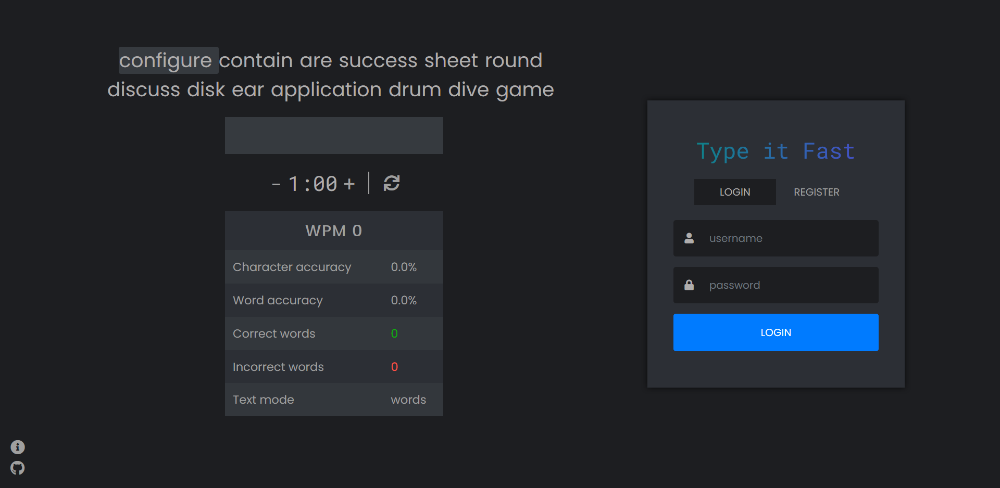
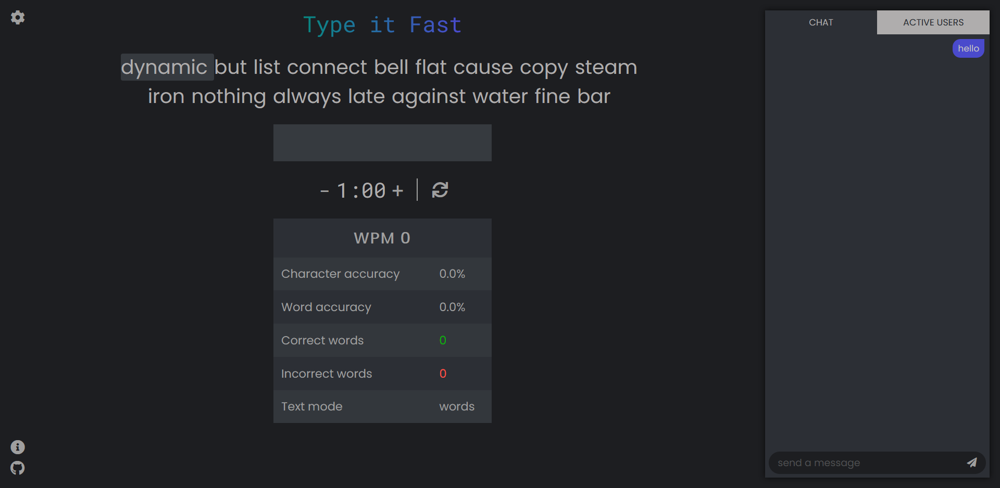

# type_it_fast
### Website for measuring your typing speed (and correctness).

Type it Fast is a minimalistic website for measuring typing speed.
You can change duration of typing test and save your results (requires account). 
You can choose to practice typing on random words or actual sentences.

Apart from taking actual speed required to type words, it also takes
into account mistakes (that you didn't correct) made along the way.

Therefore, it measures **how fast**, and **how correct** you are.

### Intro page

### Main page

 

In the future I plan to add online mode for which I think is a good idea to have chat present, 
but in the meantime feel free to pratice your typing skills.
